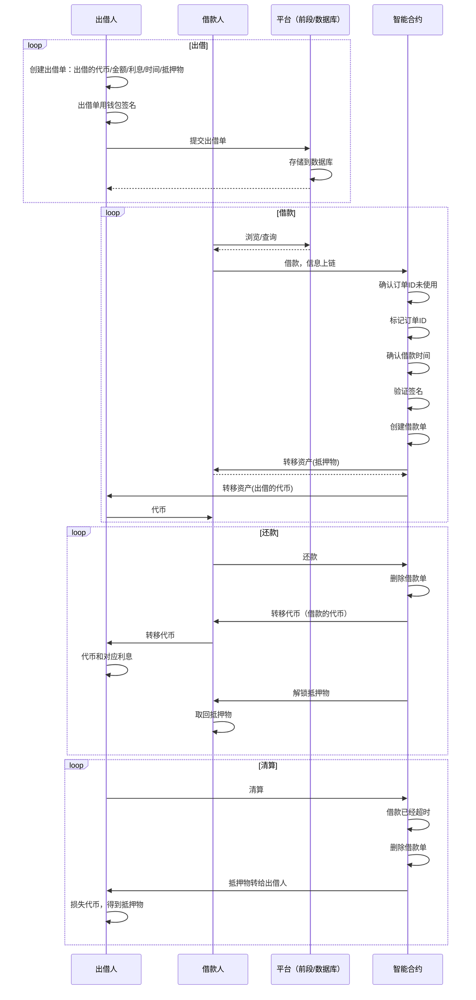

# openBorrow

DApp, lend/borrow any token

## 目标

1. 支持抵押任意代币，做多/做空代币
   1. 做多：通过平台借稳定币，购买更多代币
   2. 做空：通过平台借代币卖出，到期时（价格下跌后）偿还
2. 支持主流代币（Compound、Aave等主流协议已经支持）
3. 支持新币种、小币种的借贷。支持任意的代币，没有限制
4. 没有预言机，不用担心价格波动和价格被恶意操纵
5. 类似opensea，基于撮合，P2P借贷。

## 流程



## command

```bash
# build
npx hardhat compile

#smart contract test
npx hardhat test

# run frontend
cd frontend
yarn install
yarn dev
# http://localhost:3000
```

## 设计思路

### 合约划分

1. 主合约（router）：授权、转账
   1. 操作：borrow、lend
      1. 记录状态：挂单已经使用
      2. 记录借条：借款双方通过这个完成后续的赎回/清算
   2. 记录支持的子类型合约地址
2. 子类型合约：验签、逻辑判断
   1. 不同的借贷有不同的类型ID

### 场景

1. 借出资产
   1. 通过验签
   2. 作为调用者
   3. 通过合约校验（资金池）
2. 抵押资产借贷
   1. 通过验签
   2. 作为调用者
   3. 通过合约校验（资金池）
3. 交易
   1. 通过验签
   2. 作为调用者
   3. 通过合约校验（资金池）

### 规则

1. 根据请求，判断使用的订单验证规则
   1. 验证出借人的签名规则
      1. 规则ID=1
      2. 出借的资产类型为1：erc20
      3. ERC20的合约地址/数量
      4. 时间限制：过期时间，出借时间
      5. 利息：合约地址/数量
      6. 抵押物类型/地址/数量
      7. 是否限制借款人
2. 所有手续费都是eth

## 其他功能

1. 如何支持动态利息？
   1. 默认都是固定利息，将初始利息设置比较高
   2. 赎回时，通过退利息的方式，实现利息的降低
2. 支持NFT的借贷
   1. 默认只支持erc20的借贷
   2. 可以通过升级合约，支持NFT的借贷
